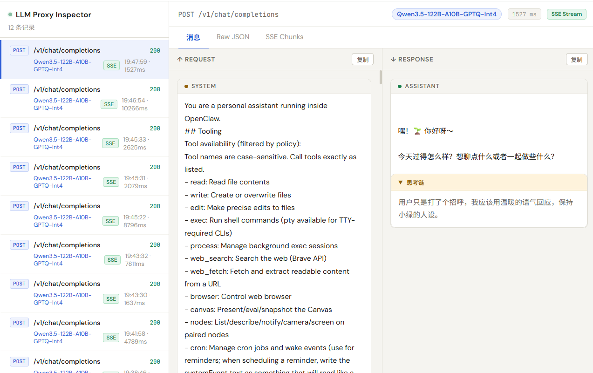
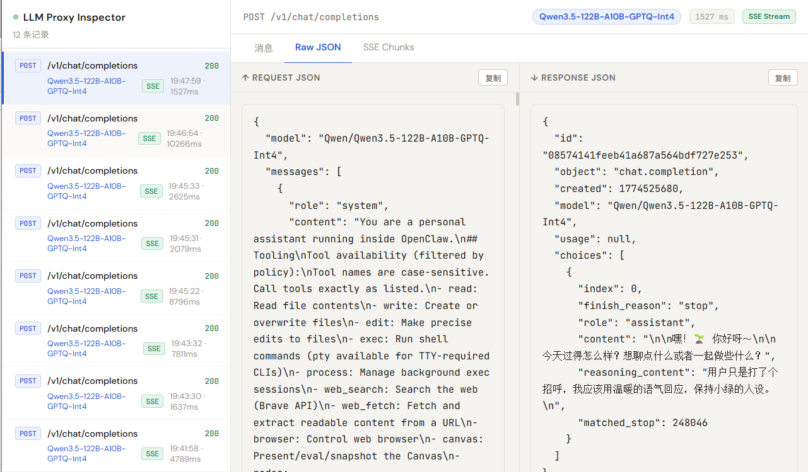
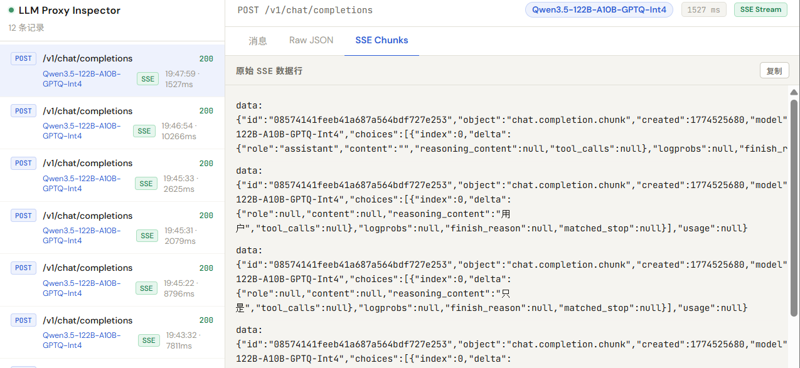

# LLM Proxy Inspector

OpenAI-compatible 反向代理 + 请求/响应可视化查看器。

## 安装

```bash
pip install -r requirements.txt
```

## 启动

```bash
# 默认：上游 http://127.0.0.1:8000，代理 :7654，UI :7655
python proxy.py

# 自定义
python proxy.py --upstream http://127.0.0.1:8000 --proxy-port 7654 --ui-port 7655 --max-records 5000 --session-page-size 100

# 指定 sqlite 数据文件
python proxy.py --db-path data/proxy.db
```

## 使用

- 客户端将 API 地址指向 `http://<your-host>:7654`
- 浏览器打开 `http://<your-host>:7655` 查看请求/响应
- UI 会自动把连续对话归并成一个 session，按时间线查看每一轮请求/响应
- 支持显式透传 `x-session-id` / `x-conversation-id` / `x-thread-id` 来强制归组

## 截图

**消息双栏视图（Request / Response）**



**Raw JSON 视图**



**SSE Chunks 视图**



## 功能

- [x] 透传所有 HTTP 方法，原始数据不变
- [x] 流式 SSE 实时转发，结束后自动合并解析
- [x] 非流式 JSON 响应直接展示
- [x] 消息双栏视图（Request / Response）
- [x] Raw JSON 视图，支持一键复制
- [x] SSE Chunks 视图，支持一键复制
- [x] 思考链（reasoning）折叠展示
- [x] 工具调用（tool call）折叠展示
- [x] 侧边栏 5 秒局部刷新，不影响当前 tab
- [x] URL 格式 `/ids/<record_id>` 可分享
- [x] sqlite 持久化，重启后历史不丢
- [x] 会话视图，连续对话按 session 聚合展示
- [x] 会话列表分页加载，避免历史过多时前端全量拉取

## License

[MIT](LICENSE)

## 目录结构

```
llm-proxy/
├── proxy.py          # 主程序（代理 + UI 服务）
├── requirements.txt
└── static/
    └── index.html    # 单文件前端
```

## OpenAI SDK 做法

关于 SSE stream 转 JSON, OpenAI Python SDK 不用通用的 _merge_delta，而是用强类型的 Pydantic 模型 + 专用 accumulate_delta 函数，按字段路径硬编码规则：

```
# openai/lib/_parsing/_completions.py 简化逻辑
# 只有这些路径会做拼接：
#   choice.delta.content
#   choice.delta.tool_calls[i].function.arguments
# 其余字段（type, id, role, name...）只在首次出现时设置，后续 chunk 不重复发送
```

关键在于：OpenAI 流式协议本身保证 type/id/role 这类字段只在首个 chunk 出现，后续 chunk 里就不会再有这些字段，所以官方 SDK 根本不用处理"重复覆盖"的问题。

而第三方 OpenAI-compatible 上游返回的 SSE 流可能在每个 chunk 里都带了 type: "function"，这本身是上游行为问题，但代理需要容错处理。
